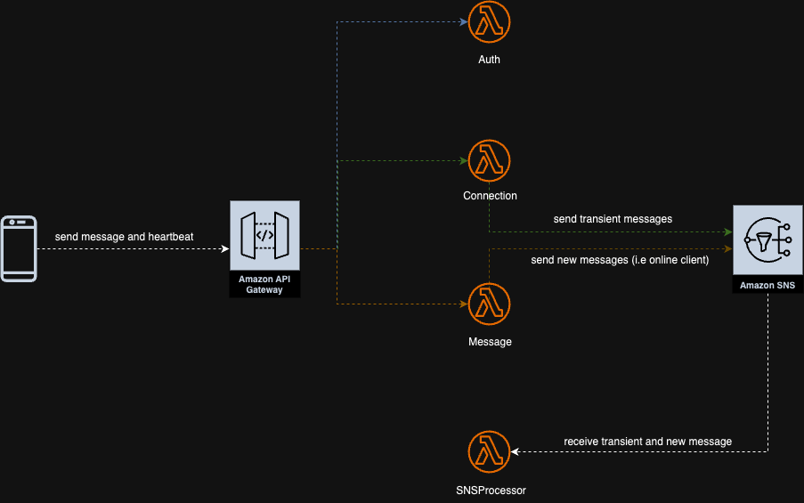

#### Instant Message Service
This is a simple instant messaging service that allows users to send and receive messages in real-time. The service is built using Java and AWS services, including AWS Lambda, AWS API Gateway, and MongoDB.
The service currently supports only one-to-one messaging at the moment, and it uses WebSocket for real-time communication. The architecture is designed to be scalable and efficient, allowing for a large number of concurrent users.

#### Technology Stack
- **Java**: Programming language for the backend service.
- **AWS**: Amazon Web Services for cloud infrastructure.
- **MongoDB**: NoSQL database for storing messages and user data.
- **AWS Lambda**: Serverless compute service for running code in response to events.
- **AWS API Gateway**: For creating, publishing, and managing APIs.
- **WebSocket**: For real-time communication between clients and the server.
- **AWS SNS**: Simple Notification Service for sending messages to multiple subscribers.


#### Environment Variables
```bash
- MONGODB_URI 
- MONGODB_DATABASE
- MESSAGE_TOPIC_ARN (SNS Topic ARN)
- API_ENDPOINT - API Gateway Websocket API URL (http)
````

#### Architecture


``` For One-to-One chat
   
    MongoDB Collection name - <username>.<username>
    
```

``` For Group chat

    MongoDB Collection name - <groupname>.group
    
   Note: Transient message must have a ref-count like shared pointer in C++ or Arc in Rust.

```

``` Friend List 
        
    MongoDB Collection name - <username>.friend 
    
```


#### Features
- Real-time messaging using WebSocket.
- One-to-one messaging.
- Heartbeat mechanism to know if the user is online or offline.
- Message storage in MongoDB. (Optional)
- User authentication using token.
- Connection management using AWS Lambda.
- Transient message storage using AWS SNS.
- Friend list management.


#### Lambda Function

- `auth-handler`  (Stateless) 
```bash
- Handles the authentication of users and generates JWT tokens for authenticated users.
- It also handles the verification of JWT tokens 
```

- `connection-handler` (Stateful) 
```bash 
- Handles the connection and disconnection of clients while also send transient messages to AWS SNS once clients they are connected.
```

- `message-handler`  (Stateful)
```bash
- Handles the sending of messages to AWS SNS and also decides if message should be stored in the cloud storage based (taking approach of being telegram) or not (taking approach of being whatsapp/signal).
- Friend list is also managed here.
```

- `message-router` (Stateful)
```bash
- Routes the messages to the appropriate destination based (send, typing, heartbeat, etc.) on the message type.
```

- `heartbeat-handler` (Stateful)
```bash
- Handles the heartbeat messages from clients to keep the connection alive.
- It also checks the last heartbeat time of the user and sends a message to AWS SNS if the user is inactive for more than 5 seconds.
```

- `snsevent-processer` (Stateless)
```bash
- Handles SNS event from [Connection-Handler] or [Message Handler] to the clients once they are connected.
- It checks user last heartbeat time and if it is more than 5 seconds apart, it sends client message to transient storage.
```

#### Assumptions
- The service is designed for one-to-one messaging only.
- The service uses MongoDB for message storage.
- The service uses AWS Lambda for serverless compute.
- The service uses AWS API Gateway for API management.
- The service uses  API Gateway WebSocket for real-time communication.
- The service uses AWS SNS for sending messages to multiple subscribers.
- send message service makes message storage optional 

#### Limitations
- does not support group messaging.
- does not support message encryption.
- does not support message delivery status. (e.g., delivered, read) 
- does not support message search functionality.
- does not support message archiving.
- No message history handler is provided.


#### How to Run
1. Clone the repository.
2. Install the required dependencies.
3. Set up the AWS services (Lambda, API Gateway, DynamoDB, S3).
4. Configure the AWS credentials.
5. Run the application.
6. Connect to the WebSocket endpoint.
7. Send and receive messages in real-time.
8. Test the application using Postman or any other API testing tool.